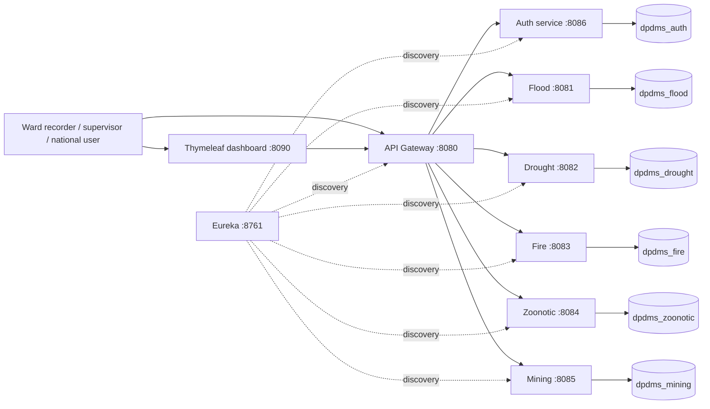

# DPDMS Architecture and Demonstration Guide

## Marker demonstration sequence

1. Open Eureka and show all services `UP`.
2. Sign in to the dashboard as `national@dpdms.local`; show only approved flood data and the map marker.
3. In Postman, login as `national@dpdms.local`, call `GET /flood/api/incidents`, and show `200 OK`.
4. Use the same token on `POST /flood/api/incidents`, and show `403 Forbidden`.
5. Login as `flood.recorder.ward1`, create a valid incident, and show its `PENDING` state.
6. Login as `flood.supervisor`, call the transition endpoint with `APPROVED`, then refresh the national dashboard.
