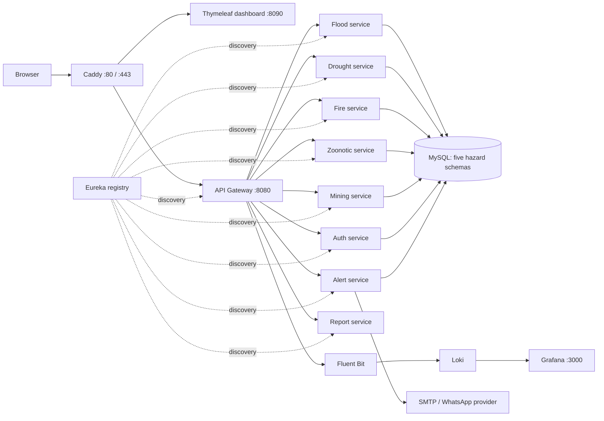
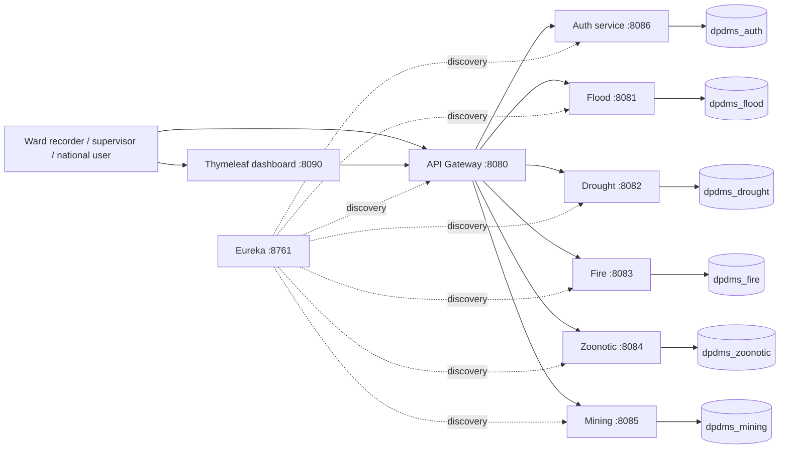

# DPDMS Architecture and Demonstration Guide

## Container deployment

```mermaid
flowchart LR
  U[Browser] --> C[Caddy :80 / :443]
  C --> UI[Thymeleaf dashboard :8090]
  C --> G[API Gateway :8080]
  G --> A[Auth service]
  G --> F[Flood service]
  G --> D[Drought service]
  G --> FI[Fire service]
  G --> Z[Zoonotic service]
  G --> M[Mining service]
  G --> AL[Alert service]
  G --> R[Report service]
  F --> DB[(MySQL: five hazard schemas)]
  D --> DB
  FI --> DB
  Z --> DB
  M --> DB
  A --> DB
  AL --> DB
  E[Eureka registry] -. discovery .-> G
  E -. discovery .-> A
  E -. discovery .-> F
  E -. discovery .-> D
  E -. discovery .-> FI
  E -. discovery .-> Z
  E -. discovery .-> M
  E -. discovery .-> AL
  E -. discovery .-> R
  G --> FB[Fluent Bit] --> L[Loki] --> GF[Grafana :3000]
  AL --> SMTP[SMTP / WhatsApp provider]
```

The Docker Compose deployment exposes the app through Caddy at `http://localhost` (or HTTPS on a configured public domain). Internal service ports are not published. The Maven development workflow below exposes separate service ports for local debugging.

## Manual Maven development architecture

```mermaid
flowchart LR
  U[Ward recorder / supervisor / national user] --> UI[Thymeleaf dashboard :8090]
  U --> G[API Gateway :8080]
  UI --> G
  G --> A[Auth service :8086]
  G --> F[Flood :8081]
  G --> D[Drought :8082]
  G --> FI[Fire :8083]
  G --> Z[Zoonotic :8084]
  G --> M[Mining :8085]
  F --> FDB[(dpdms_flood)]
  D --> DDB[(dpdms_drought)]
  FI --> FIDB[(dpdms_fire)]
  Z --> ZDB[(dpdms_zoonotic)]
  M --> MDB[(dpdms_mining)]
  A --> ADB[(dpdms_auth)]
  E[Eureka :8761] -. discovery .-> G
  E -. discovery .-> F
  E -. discovery .-> D
  E -. discovery .-> FI
  E -. discovery .-> Z
  E -. discovery .-> M
  E -. discovery .-> A
```

## Marker demonstration sequence

1. Start Docker Compose and show that the service containers are `Up` with `docker compose --env-file .env -f deploy/compose.yml ps`.
2. Sign in to the Compose dashboard with the bootstrap National account configured in `.env`. For the Maven demo, use `national@dpdms.local`.
3. Show approved records, the hazard/severity/status dashboard counts, a recent-approved-record list, and the approved-record map.
4. In the API client, use the National token to call `GET /flood/api/incidents` and show `200 OK`; call `POST /flood/api/incidents` with the same token and show `403 Forbidden`.
5. Sign in as `flood.recorder.ward1`, create a valid flood incident, and show its `PENDING` state to the recorder.
6. Sign in as `flood.supervisor`, approve the incident, and refresh the National dashboard to show the newly approved record.
7. Demonstrate the other hazards using their hazard-specific demo recorder/supervisor accounts. The cross-hazard recorder, supervisor, and Provincial Admin scopes in this build are deliberate user-requested deviations from the assignment rubric; see the scope note in the README.
